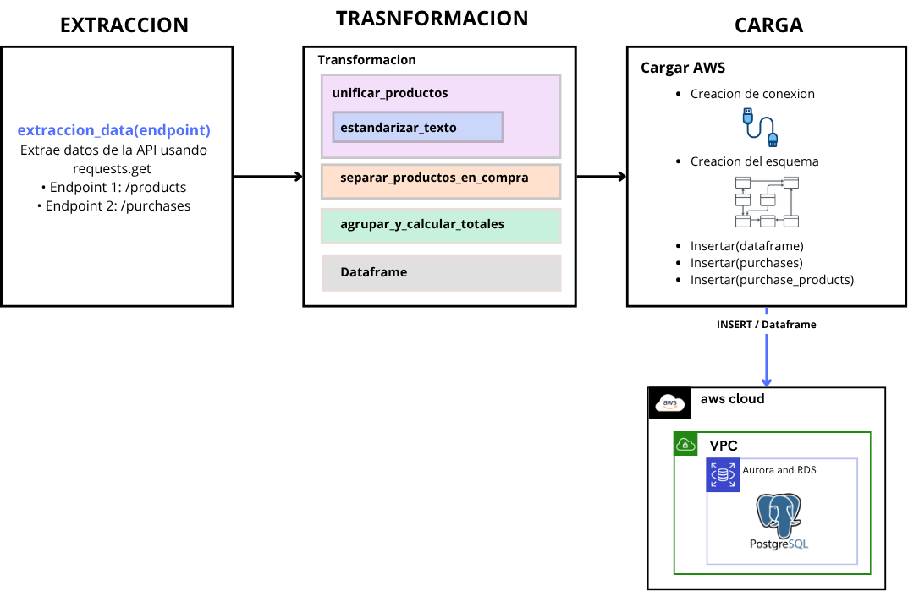
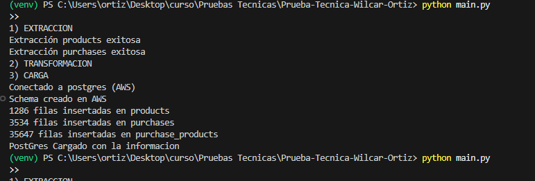
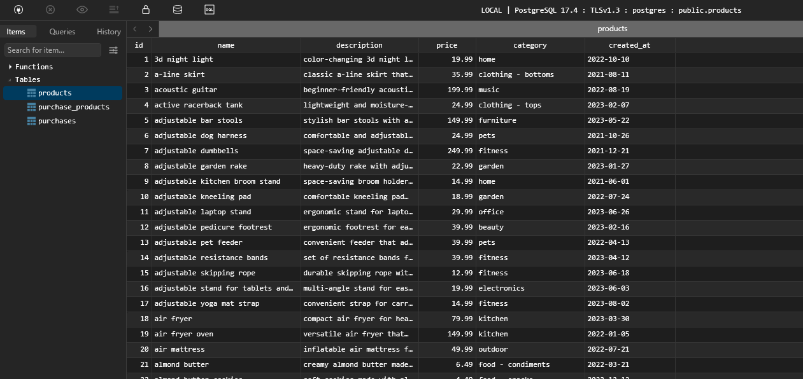
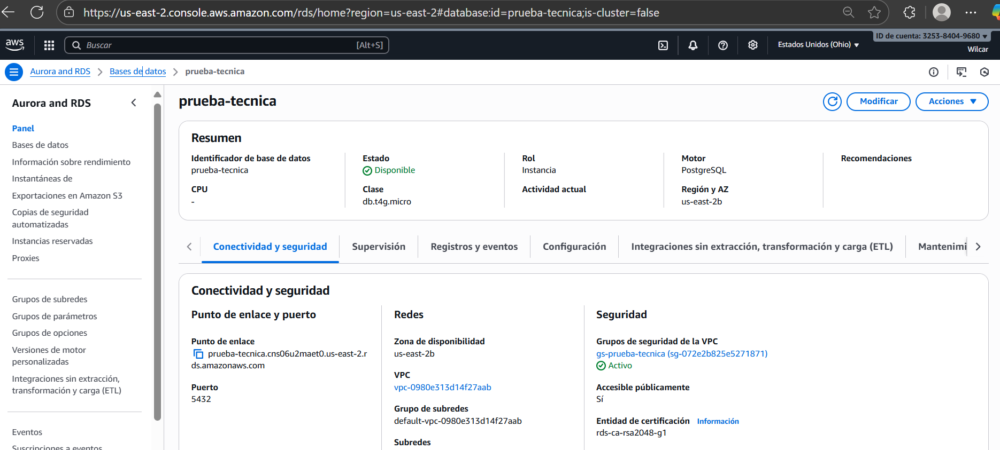

# Proyecto ETL - Prueba Técnica

<p align="center">
  <a href="https://www.python.org/" target="_blank">
    
  </a>
</p>


PIPELIN construido con **python** siguiendo buenas prácticas, con almacenamiento en **Postgress** en la nube de **AWS** para que sea accesible desde cualquier lugar el Data Warehouse.

El proyecto se centra en la extracción de información de una API, específicamente de productos y compras, donde los identificadores no son únicos. La solución propuesta incluye las transformaciones necesarias para generar una fuente de información unificada, garantizando mayor trazabilidad y consistencia de los datos.

##  Tecnologias

<p align="center">
  
  
  
  
  
  
  
  
</p>

---


### 🐍 Utilidades
| Paquete | Versión | Descripción |
|----------|----------|-------------|
| `pandas` | 2.3.3 | Manipulación y transformación de datos |
| `psycopg2-binary` | 2.9.11 | Conector de Python con PostgreSQL |
| `python-dotenv` | 1.1.1 | Manejo de variables de entorno (.env) |
| `requests` | 2.32.5 | Consumo de APIs REST (extracción de datos) |

### 🧩 Arquitectura ETL
- **Extracción:** API REST con `requests`
- **Transformación:** Limpieza y estandarización con `pandas`
- **Carga:** Inserción a base de datos AWS RDS/Aurora mediante `psycopg2`


## ⚙️ Instruccion de ejecucion

1. Version de python **Python 3.14**

2. Clonar el repositorio
```
https://github.com/WilcarOrtiz/Prueba-Tecnica-Wilcar-Ortiz.git
```
3. Crear entorno virtual
```
python -m venv venv
```
4. Activar entorno virtual 
```
.\venv\Scripts\activate
```
5. Instalar paquetes
```
pip install -r requirements.txt
```
6. verificar instalacion de paquetes
```
pip list
```
7. Clonar el archivo **.env.template** y renombralo a **.env**
8. Cambiar las variables de entorno 
9. Correr el proyecto  
```
python main.py
```
## SQL
SQL que utilizado para construir el schema para el almacenamiento de informacion
```
DROP TABLE IF EXISTS purchase_products;
DROP TABLE IF EXISTS purchases;
DROP TABLE IF EXISTS products;
DROP TYPE IF EXISTS purchase_status;

CREATE TYPE purchase_status AS ENUM ('pending', 'completed', 'cancelled');

CREATE TABLE IF NOT EXISTS products (
    id INT PRIMARY KEY,
    name VARCHAR(255),
    description TEXT,
    price FLOAT,
    category VARCHAR(100),
    created_at DATE
);

CREATE TABLE IF NOT EXISTS purchases (
    id VARCHAR(50) PRIMARY KEY,
    status purchase_status,
    credit_card_type VARCHAR(50),
    purchase_date DATE,
    total FLOAT
);

CREATE TABLE IF NOT EXISTS purchase_products (
    purchase_id VARCHAR(50),
    product_id INT,
    quantity INT,
    PRIMARY KEY (purchase_id, product_id),
    FOREIGN KEY (purchase_id) REFERENCES purchases(id),
    FOREIGN KEY (product_id) REFERENCES products(id)
);
```


##  Diagrama ETL



### 🔹 Transformaciones Clave

A continuación se describen las funciones principales del proceso de transformación para mayor claridad:

| Función                                                  | Descripción                                                                  |
| -------------------------------------------------------- | ---------------------------------------------------------------------------- |
| `transformacion(productos_data, purchases_data)`         | Orquesta toda la lógica de transformación del ETL.                           |
| `estandarizar_texto(columnas, tabla)`                    | Convierte texto a minúsculas en columnas específicas para uniformidad.       |
| `unificar_productos(productos_data)`                     | Añade `id_interno` para identificar productos con la misma información base. |
| `separar_productos_en_compra(purchases_data)`            | Explota arrays de productos para generar un registro por ítem.               |
| `agrupar_y_calcular_totales(productos_df, purchases_df)` | Agrupa datasets y calcula totales por compra.                                |


## EVIDENCIA DE EJECUCION
A continuacion se presenta las evidencia del funcionamiento del pipeline, desde su ejecucion hasta el almacenamiento de informacion en la nube de AWS

1. Evidencia de correcta ejecucion del  pipeline en **VScode**



2. Evidencia de correcto almacenamiento (**Table Plus Local**, conectado a la base mediante la url proporcionada por AWS)



3. Evidencia de ejecucion de la **base en la nube**



